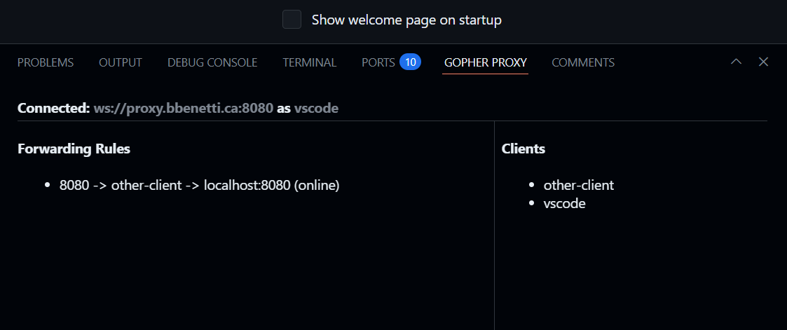

# GopherProxy vscode Extension

This vscode extension provides an interface for [gopherproxy](https://github.com/BenjaminBenetti/gopherproxy) that you can use
from inside vscode. This provides similar functionality to the `ports` tab, but allows you to directly tunnel multiple systems
together through a [gopherproxy](https://github.com/BenjaminBenetti/gopherproxy) server.

This extension provides a new tab in the terminal panel called "GopherProxy". This tab allows you manage your connection to the [gopherproxy](https://github.com/BenjaminBenetti/gopherproxy) server and change routing rules on the fly.

#### Features

- Connect any number of systems together regardless of network environment or firewalls. Allowing you to construct complex development environments across many computers, anywhere in the world.
- Forward ports from your [vscode remote server](https://code.visualstudio.com/docs/remote/vscode-server) to your local machine seamlessly. Especially useful for Windows hosts which provide no SSH access.
- Free and open source. I provide a public [gopherproxy](https://github.com/BenjaminBenetti/gopherproxy) server at `wss://proxy.bbenetti.ca` for anyone to use. However, you can easily host your own server with basically no setup required. Just download the server binary for the [latest release](https://github.com/BenjaminBenetti/gopherproxy/releases/latest) and run it on your own server. The websocket based proxy makes it easy to deploy into any existing layer 7 infrastructure, like Kubernetes.
